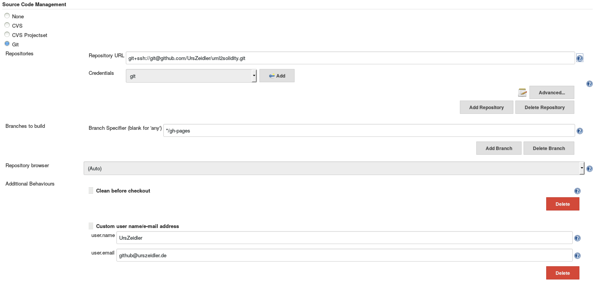

# EclipseUpdatesiteForGithub

This document describes a jenkis job to create an updatesite hosted on the gh-pages and also releases the ziped udatesite.
The main source are from the last answer of this thread  http://stackoverflow.com/questions/2801567/is-it-possible-to-host-an-eclipse-update-site-on-github . 

#### prequisite

* jenkins  (https://jenkins.io/index.html) and an already runnig job to create the p2 updatesite (can be a maven build or done with buckminster) and the following plugins installed :
 * Git Plugin  https://wiki.jenkins-ci.org/display/JENKINS/Git+Plugin
 * Parameterized Trigger Plugin https://wiki.jenkins-ci.org/display/JENKINS/Parameterized+Trigger+Plugin
 * Copy Artifact Plugin https://wiki.jenkins-ci.org/display/JENKINS/Copy+Artifact+Plugin
 * Buckminster PlugIn https://wiki.jenkins-ci.org/display/JENKINS/Buckminster+PlugIn
 * Release Plugin https://wiki.jenkins-ci.org/display/JENKINS/Release+Plugin
 * Ant Plugin https://wiki.jenkins-ci.org/display/JENKINS/Ant+Plugin
 * Maven Project Plugin https://wiki.jenkins-ci.org/display/JENKINS/Maven+Project+Plugin (when you use maven to build)
 
Add a working buckmister and ant installation this is done on the "Configure System" page.   
 
  ==>   

##### 1. activate the github pages for your project
 
This is a simple step described for example here https://pages.github.com/.

##### 2. Create an api token

To create a release and push your artifact to githup you need an api token see https://github.com/blog/1509-personal-api-tokens .

##### 3. Configure your jekins job

This is the main part. We go thru this step by step.

###### Source code Management

We use github of course, and we checkout the ´*/gh-pages` branch, it is important to ´Clean before checkout`

###### Build Environment

The build need to be a release build with two parameters, the version which will be used as the release version and a description for the release. Note that the description can't have multiple lines.

Both parameters will be used by the ant script.

 

###### Before release build

Before we release we need to create the artifacts, the simples way is using the basic job of our project as this creates the updatesite.

 

###### Build 

