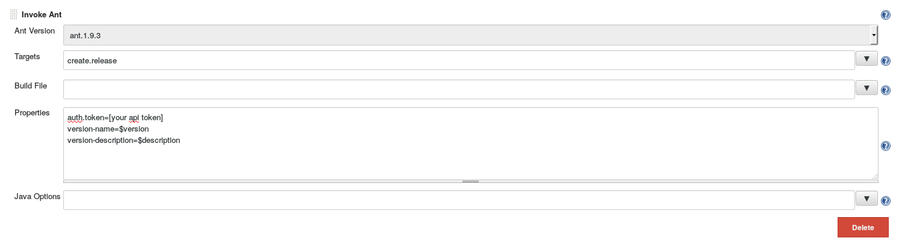

# EclipseUpdatesiteForGithub

This document describes a jenkis job to create an updatesite hosted on the gh-pages and also releases the ziped udatesite.
The main source for hosting the updatesite are from the last answer of this thread  http://stackoverflow.com/questions/2801567/is-it-possible-to-host-an-eclipse-update-site-on-github . 

#### prequisite

* jenkins  (https://jenkins.io/index.html) an already runnig job to create the p2 updatesite (can be a maven build or done with buckminster) and the following plugins installed :
 * Git Plugin  https://wiki.jenkins-ci.org/display/JENKINS/Git+Plugin
 * Parameterized Trigger Plugin https://wiki.jenkins-ci.org/display/JENKINS/Parameterized+Trigger+Plugin
 * Copy Artifact Plugin https://wiki.jenkins-ci.org/display/JENKINS/Copy+Artifact+Plugin
 * Buckminster PlugIn https://wiki.jenkins-ci.org/display/JENKINS/Buckminster+PlugIn
 * Release Plugin https://wiki.jenkins-ci.org/display/JENKINS/Release+Plugin
 * Ant Plugin https://wiki.jenkins-ci.org/display/JENKINS/Ant+Plugin
 * Maven Project Plugin https://wiki.jenkins-ci.org/display/JENKINS/Maven+Project+Plugin (when you use maven to build)

You will also need a shell environment which supports wget and curl. 
 
Add a working buckmister and ant installation. This is done on the "Configure System" page.   
 
  ==>   

##### 1. activate the github pages for your project
 
This is a simple step described for example here https://pages.github.com/.

##### 2. Create an api token

To create a release and push your artifact to githup you need an api token see https://github.com/blog/1509-personal-api-tokens .

#### 3. Configure your jekins job

This is the main part. We go through this step by step. You will need the ant script contains in the `etc` folder of this project. Copy it to some place in in your project where it does not bother you.

###### Source code Management

We use github of course, and we checkout the `*/gh-pages` branch, it is important to `Clean before checkout`

###### Build Environment

The build need to be a release build with two parameters, the version which will be used as the release version and a description for the release. Note that the description can't have multiple lines.

Both parameters will be used by the [ant script]().

 

###### Before release build

Before we release we need to create the artifacts, the simples way is using the basic job of our project as this creates the updatesite.

 

###### Build 

The main build action is to mirror the created update site in the gh-pages updatesite, with this the old update site will not get deleted instead the new updatesite will be merged in. So people can reverse the installation to an older version.

You will find the script in the `etc` folder of this project. You need to adjust it to your needs and configuration.

The build action is `Execute shell`

 

###### After successful release build

After we created the updatesite, first we need to commit the changes.

 

And push it back to the gh-pages branch via the Git publisher.

Now we copy the ant script to the workspace with a simple wget from your repository. The ant script will use the github api to add the ziped updatesite on the release page and creating a release.

For this we copy the already created updatesite from the basic job in the workspace. Choose your file selector wisely to get only the updatesite and flatten the directories so the updatesite is in the root of the workspace. 

Finally we call the ant script, here we need the api token as we create a github release and push the artifact.

 

### Trigger the release

To trigger the release choose  which brings you to the `define release` page and set the release parameters.

 

#### Activate the release

The ant script creates the release as a draft, so after the build the release is not visible to others.

Browse the the release page of your project, add the release information publish the release and your are done.

Found a bug, a typo, a misleading description:

Feel free to open an [issue](https://github.com/UrsZeidler/EclipseUpdatesiteForGithub/issues)
